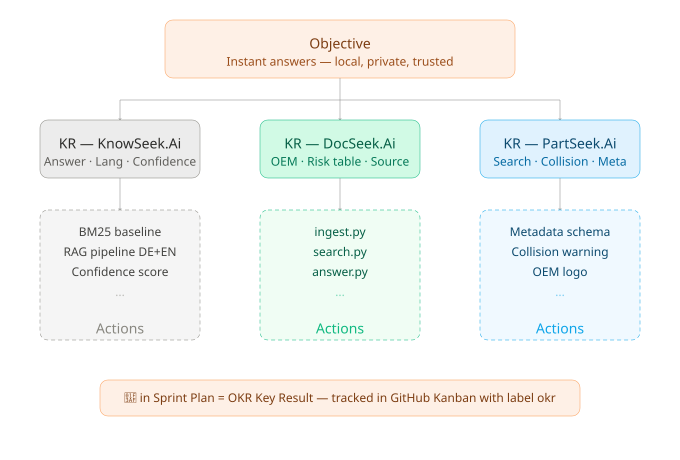
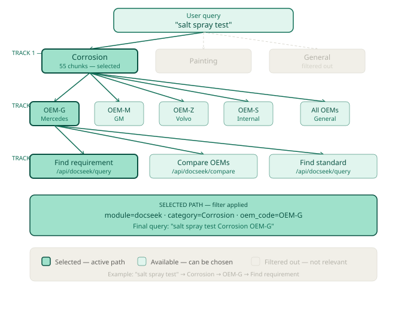
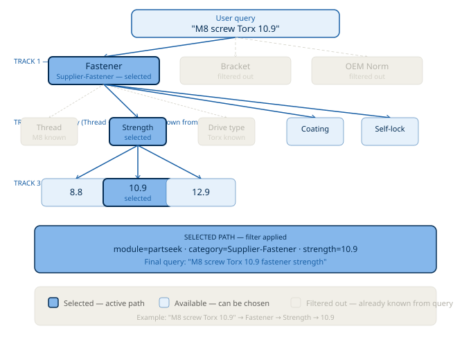

# KnowSeek.ai — RnD Description
**On-Premise AI Knowledge Platform**
*Capstone Project — MVP Reference Document*
*Version: rev07_002 — Last updated: 27.03.2026 21:10 — Branch: main_sia08*

> All data stays local. No cloud. No internet required.

---

## Module Overview

| # | Module | Color | Status |
|---|--------|-------|--------|
| 01 | **DocSeek.ai** | Emerald Green #10B981 | ✅ MVP |
| 02 | **PartSeek.ai** | Electric Blue #0EA5E9 | ✅ MVP |
| 03 | **NormSeek.ai** | Indigo #9199F4 | ⏳ Phase 2 |
| 04 | **CostSeek.ai** | Orange #FC9D57 | ⏳ Phase 3 |

**Midterm: 20.03.2026 ✅ · Dry Run: 27.03.2026 · Stakeholder: 02.04.2026**
**Solo developer · On-Premise / Ollama**

---

## 1. Vision

KnowSeek.ai is a fully local AI knowledge platform for industrial companies.

Engineers ask questions in plain German or English and get a direct answer — with the exact source included. Everything runs on the company's own machine. No internet needed. No data ever leaves the building.

**Key principle:** Fast answers. Local. Private. Secure.

---

## 2. The Problem

Engineers waste time every day because of:

- PDF specs scattered across folders and projects
- No easy way to compare requirements across different OEMs
- Long searches in parts catalogs — often repeated by different people
- Conflicting standards and norms with no clear overview
- New team members take weeks to find the right documents
- No visibility into what colleagues already searched for

**The result:** Slower development, higher costs, quality risks, and knowledge stuck in people's heads instead of being shared.

KnowSeek.ai solves this directly.

---

## 3. Who Is It For?

- Automotive suppliers
- Mechanical engineering companies
- Development and engineering teams
- Quality management
- Purchasing and cost engineering
- Any company that must keep data on-premise (GDPR / IP protection)

---

## 4. OKR — Objectives & Key Results

### Objective (Platform)

> "Give engineers instant answers from their own documents —
> local, private, with source included, and a clear trust signal
> 🟢🟡🔴 they can see at a glance."



### Key Results — MVP Overall

| # | Key Result | How We Measure It |
|---|------------|------------------|
| KR1 | Answer time measured + visualized | Baseline vs RAG — bar chart in EDA.ipynb |
| KR2 | System runs 100% offline — verified | No external API calls during query — network monitor check |
| KR3 | Works in multi language (DE, EN) | Test queries in both languages — results verified ✅ |
| KR4 | Confidence score 🟢🟡🔴 shown on every result | Visible on every result card in frontend ✅ |

### Key Results — DocSeek.ai

| # | Key Result | How We Measure It |
|---|------------|------------------|
| KR1 | 3 OEM comparisons working (OEM-V / OEM-W / OEM-G) | Demo scenario runs without errors |
| KR2 | Risk table correct (same / different / conflict) | Verified against known test documents |
| KR3 | Source link clickable on every result | Manual test — every result has source |

### Key Results — PartSeek.ai

| # | Key Result | How We Measure It |
|---|------------|------------------|
| KR1 | Text search finds correct part — time visualized | Measured + shown in EDA.ipynb |
| KR2 | Team collision warning works | Tested with 2 similar part queries |
| KR3 | All metadata shown (material, strength, OEM logo) | Verified on demo datasheets |

---

## 5. How It Works — RAG Pipeline with Hybrid Search

KnowSeek.ai uses **RAG — Retrieval Augmented Generation** with a **Hybrid Search** pre-filter.

```
STEP 1 — Ingest (done once):
Documents → split into chunks → convert to vectors → store in ChromaDB

STEP 2 — Answer (every query) — Hybrid Search Pipeline:

  Query
    ↓
  Domain Check (BM25 keywords)
  No automotive keywords? → 🔴 RED — STOP — no ChromaDB, no llama3
    ↓
  ChromaDB Semantic Search
  Find top N similar chunks by vector distance
    ↓
  BM25 Reranking
  Score each chunk by keyword match
  BM25 = 0 → override to 🔴 RED
    ↓
  llama3 (only for GREEN/YELLOW chunks)
  Generate answer from verified context
    ↓
  Answer + confidence 🟢🟡🔴 + source
```

**Why Hybrid Search?**

Semantic search alone answers: *"Which chunk is most similar?"* (relative)
BM25 keyword search answers: *"Does this query match our knowledge?"* (absolute)

Combined, they prevent nonsense queries from getting high confidence signals:
- "bitcoin cryptocurrency" → BM25 = 0 → 🔴 RED immediately
- "salt spray test" → BM25 > 0 → semantic search + llama3 ✅

**Confidence traffic light:**

| Score | Color | Meaning |
|-------|-------|---------|
| > 85% | 🟢 Green | Reliable answer — source found |
| 60–85% | 🟡 Yellow | Partial match — check the source |
| < 60% | 🔴 Red | Low confidence — verify manually |
| BM25 = 0 | 🔴 Red | Query outside knowledge domain |

**FastAPI connects the AI backend to the React frontend:**

```
React Frontend  →  FastAPI  →  Hybrid Search → ChromaDB → llama3
(JavaScript)       (Python)    (BM25 + Semantic)  (vectors)  (answers)

POST /api/docseek/query   ← document question
POST /api/partseek/query  ← part search
GET  /api/health          ← server status check
```

---

## 6. Tech Stack — MVP

### Selected Tools

| Component | Technology | Why |
|-----------|-----------|-----|
| LLM | llama3:8b via Ollama | 100% offline, runs well on Mac M1 |
| Embedding model | nomic-embed-text via Ollama | Full DE + EN support, no extra package |
| Hybrid Search | ChromaDB + rank-bm25 | Semantic + keyword — accurate + fast |
| Baseline model | rank-bm25 | Keyword search — baseline for MLFlow comparison |
| Vector database | ChromaDB | Simple, local, persistent, no server needed |
| RAG framework | LangChain | PDF/DOCX/XLSX loaders + memory + multi-query |
| OCR | pytesseract + Pillow + fpdf2 | Convert image-based files to searchable PDF |
| Backend API | FastAPI (Python 3.11.3) | REST API between AI logic and frontend |
| Frontend | React + Vite + TailwindCSS | Fast, modern UI |
| UI components | shadcn/ui + Framer Motion | Spring physics animations |
| Experiment tracking | MLFlow (local, port 5000) | Track and compare model experiments |
| Infrastructure | Docker Compose *(planned)* | One command starts everything |
| Dev machine | Mac M1 16GB | Unified memory — Ollama runs fast |

### Ollama — Two Functions

> Ollama is used for TWO functions in KnowSeek.ai:
> 1. **LLM** — `llama3:8b` — generates answers
> 2. **Embedding** — `nomic-embed-text` — converts text to vectors (DE + EN)

### Embedding Model — Why We Chose nomic-embed-text

| Model | Size | DE Support | Decision |
|-------|------|-----------|----------|
| all-MiniLM-L6-v2 | 80MB | ❌ | Rejected — English only |
| paraphrase-multilingual-MiniLM-L12-v2 | 120MB | ✅ | Rejected — extra package needed |
| paraphrase-multilingual-mpnet-base-v2 | 280MB | ✅ | Rejected — too large |
| all-mpnet-base-v2 | 420MB | ❌ | Rejected — English only |
| **nomic-embed-text (Ollama)** | 270MB | ✅ | ✅ **Selected** |

### Image Recognition Model — Evaluated

| Model | Type | Decision | Notes |
|-------|------|----------|-------|
| LLaVA (Ollama) | Vision LLM — describes images in text | 🟡 Phase 2 | No training needed — start with 10 images |
| YOLO (Ultralytics) | Object detection — finds + classifies parts | 🟡 Phase 2 | Can start with 10 images, improve over time |

> **YOLO strategy — incremental approach:**
> - Start with 10 images → Proof of Concept
> - Add 50 images → Better recognition
> - Add 500 images → Production ready
> - Dataset source: Roboflow Universe — pre-labeled fastener datasets available
> - ChromaDB architecture already supports image chunks — no restructuring needed
> - Image chunks get module="partseek" + doc_type="Image"

### Visualization Tools (Notebooks)

| Tool | Purpose |
|------|---------|
| Pandas | Load and analyze data |
| Seaborn | Statistical charts, heatmaps |
| Plotly | Interactive charts, spider diagram |
| MLFlow UI | Experiment comparison (port 5000) |

---

## 7. Code Structure — Python + Notebooks

All production logic lives in `.py` files. Notebooks call these files and are only used for visualization and EDA.

```
01_backend/
├── main.py             ✅ rev07_002 — FastAPI all 4 modules (port 8001)
├── modules/
│   ├── 01_partseek/
│   │   ├── ingest.py   ✅ rev06_001 — calls DocSeek ingest pipeline
│   │   ├── search.py   ✅ rev07_002 — filter by module="partseek"
│   │   └── answer.py   ✅ rev07_002 — structured results + collision warning
│   ├── 02_docseek/
│   │   ├── ingest.py   ✅ rev06_001 — load, OCR, chunk, module tag, store
│   │   ├── search.py   ✅ rev07_002 — Hybrid Search: Domain + ChromaDB + BM25
│   │   └── answer.py   ✅ rev07_002 — RAG + Hybrid Search + OEM comparison
│   ├── 03_normseek/    ⏳ Phase 2
│   └── 04_costseek/    ⏳ Phase 3
└── utils/
    ├── check_pdfs.py   ✅ rev06_001 — auto OCR check for all modules
    ├── yolo_ingest.py  ✅ rev07_001 — LLaVA + YOLO image ingestion
    └── yolo_train.py   ✅ rev07_001 — YOLO training pipeline

06_notebooks/
└── EDA.ipynb           ✅ rev07_002 — Chapter 1-6 + Hybrid Search viz
```

**Key functions:**
- `get_language(text)` — detects DE vs EN automatically
- `get_category(filename)` — maps filename to category
- `get_module(category)` — assigns module based on category
- `get_oem_code(filename)` — maps filename to OEM code
- `check_domain_relevance(query)` — domain keyword check
- `rerank_with_bm25(query, results)` — BM25 keyword reranking
- `run_ingest()` — full pipeline: load → chunk → vectorize → store

> The notebook is the **window** — the .py files are the **engine**.

---

## 8. EVA — **I**nput / **P**rocessing / **O**utput

| Symbol | German | English |
|--------|--------|---------|
| E | Eingabe | Input |
| V | Verarbeitung | Processing |
| A | Ausgabe | Output |

**Rating:**

| Symbol | Meaning |
|--------|---------|
| 🟢 | Reliable — tested, works as expected |
| 🟡 | Conditional — works with limitations |
| 🔴 | Not in MVP — Phase 2 or 3 |
| `*` | Phase 2 planned |
| `**` | Phase 3 planned |

---

### E — INPUT

#### E1. File Formats

| Format | Tool | R/Y/G | Notes |
|--------|------|--------|-------|
| PDF (digital) | pdfplumber + LangChain | 🟢 | Main format — specs, reports, standards |
| PDF (scanned) | pytesseract (OCR) | 🟡 | Quality depends on scan resolution |
| PNG / WEBP (images) | pytesseract + fpdf2 | 🟡 | Converted to searchable PDF via OCR ✅ |
| Word (.docx) | LangChain DocLoader | 🟢 | Technical documents, reports |
| Excel (.xlsx) | LangChain + openpyxl | 🟢 | Requirements lists, test tables |
| Images with tables | pdfplumber | 🟡 | Digital PDFs only — not scanned |
| CAD drawings (DXF/DWG) | PyMuPDF | 🟡 | Text fields only — no geometry |
| Part images (YOLO/LLaVA)* | YOLO / LLaVA | 🟡 | Phase 2 — start with 10 images |
| Email (.msg/.pst) | extract-msg* | 🔴 | Phase 2 — use PDF export for MVP |
| CAD metadata (NX) | NX Open API** | 🔴 | Phase 3 |
| JT 3D files | jt-js + three.js* | 🔴 | Phase 2 |

> **Info: Anonymization Schema for Test Data**
>
> | Code | Theme | OEM | Kürzel |
> |------|-------|-----|--------|
> | OEM-G | US Presidents (GEORGE) | Mercedes-Benz | _PM |
> | OEM-M | Disney (MICKEY) | GM | _PG |
> | OEM-Z | Greek Gods (ZEUS) | Volvo | _PV |
> | OEM-H | Greek Gods (HADES) | Volvo | _PV |
> | OEM-S | Musicians (SWIFT) | China / Internal | _CH |
> | _SIA | — | Internal (Antonios) | _SIA |

#### E2. Language Support

| Model | Size | DE Support | Decision |
|-------|------|-----------|----------|
| all-MiniLM-L6-v2 | 80MB | ❌ | Rejected — English only |
| paraphrase-multilingual-MiniLM-L12-v2 | 120MB | ✅ | Rejected — extra package |
| paraphrase-multilingual-mpnet-base-v2 | 280MB | ✅ | Rejected — too large |
| all-mpnet-base-v2 | 420MB | ❌ | Rejected — English only |
| **nomic-embed-text (Ollama)** | 270MB | ✅ | ✅ Selected |

#### E3. User Input

| Input Type | Module | R/Y/G | Notes |
|------------|--------|--------|-------|
| Free text query (DE/EN) | DocSeek + PartSeek | 🟢 | Core feature — verified ✅ |
| Follow-up questions | DocSeek | 🟢 | Last 5 queries remembered |
| Multi-document comparison | DocSeek | 🟢 | Multi-Query Retrieval (LangChain) |
| Image upload (photo of part) | PartSeek | 🟡 | Phase 2 — YOLO / LLaVA |
| Voice input | — | 🔴 | Not planned |

---

### V — PROCESSING

#### V1. Document Processing

| Step | Tool | R/Y/G | Notes |
|------|------|--------|-------|
| PDF text extraction | pdfplumber | 🟢 | Best for digital PDFs with tables |
| PDF image extraction | PyMuPDF (fitz) | 🟢 | Images + metadata |
| OCR (scanned docs + images) | pytesseract + Pillow | 🟡 | Tested on fastener datasheets ✅ |
| Image → searchable PDF | fpdf2 | 🟢 | OCR text saved as PDF ✅ |
| Language detection | get_language() | 🟢 | DE vs EN — heuristic keyword check ✅ |
| Module assignment | get_module() | 🟢 | category → module tag ✅ |
| Domain relevance check | check_domain_relevance() | 🟢 | BM25 keyword filter — pre-LLM ✅ |
| BM25 reranking | rerank_with_bm25() | 🟢 | Keyword validation post-ChromaDB ✅ |
| DOCX parsing | LangChain DocLoader | 🟢 | Clean extraction |
| XLSX parsing | LangChain + openpyxl | 🟢 | Tables and structured data |
| Image recognition | YOLO / LLaVA* | 🟡 | Phase 2 — incremental training |

#### V2. Chunking Strategy

| Document Type | Size | Chunk | Overlap | R/Y/G |
|---------------|------|-------|---------|--------|
| 1-Pager (1–2 pages) | < 1MB | 256 | 50 | 🟢 |
| Technical sheet (5–20p) | 1–3MB | 500 | 100 | 🟢 |
| Small Lastenheft (~50p) | ~6MB | 500 | 100 | 🟢 |
| Large Lastenheft (~300p) | ~10MB | 1000 | 200 | 🟡 |

#### V3. Vector Database

| Tool | R/Y/G | Decision | Notes |
|------|--------|----------|-------|
| **ChromaDB** | 🟢 | ✅ Selected | Local, simple, persistent |
| FAISS | 🟡 | ❌ Rejected | Faster but limited metadata support |

#### V4. Search Strategy — Hybrid Search (rev06_002)

| Step | Tool | R/Y/G | Notes |
|------|------|--------|-------|
| Domain Check | DOMAIN_KEYWORDS + BM25 | 🟢 | Pre-filter — no keywords → RED immediately |
| Semantic Search | ChromaDB + nomic-embed-text | 🟢 | Vector similarity search |
| BM25 Reranking | rank-bm25 | 🟢 | Keyword validation — BM25=0 → RED |
| LLM Answer | llama3 | 🟢 | Only called for GREEN/YELLOW results |

#### V5. RAG Framework

| Tool | R/Y/G | Decision | Notes |
|------|--------|----------|-------|
| **LangChain** | 🟢 | ✅ Selected | Loaders + Memory + Multi-Query |

#### V6. LLM + Baseline

| Model | Size | R/Y/G | Decision |
|-------|------|--------|----------|
| **llama3:8b (Ollama)** | 4.7GB | 🟢 | ✅ Selected — main model |
| **rank-bm25** | — | 🟢 | ✅ Dual role: Baseline + Hybrid Search filter |
| LLaVA (Ollama)* | 4.5GB | 🟡 | Phase 2 — vision model |

#### V7. Experiment Tracking

| Tool | R/Y/G | Decision | Notes |
|------|--------|----------|-------|
| **MLFlow (local)** | 🟢 | ✅ Selected | Tracks embedding + chunking experiments |

**MLFlow Experiments logged:**
- BM25 Baseline — avg_score: 4.712, avg_time: 0.19ms ✅
- RAG llama3 — avg_score: 0.861, avg_time: 17932ms ✅

#### V8. Memory & Conversation

| Feature | Tool | R/Y/G | Notes |
|---------|------|--------|-------|
| Follow-up questions | ConversationBufferMemory | 🟢 | Last 5 queries |
| Multi-doc comparison | Multi-Query Retrieval | 🟢 | e.g. OEM-V vs OEM-W vs OEM-G |
| Long-term memory | — | 🔴 | Not in MVP |

#### V9. Infrastructure

| Service | Port | R/Y/G | Notes |
|---------|------|--------|-------|
| Ollama (llama3 + nomic-embed-text) | 11434 | 🟢 | ✅ Running |
| ChromaDB | local | 🟢 | ✅ Installed + tested |
| FastAPI Backend | 8001 | 🟢 | ✅ Running — DocSeek + PartSeek |
| React Frontend | 8081 | 🟢 | ✅ Running |
| MLFlow UI | 5000 | 🟢 | ✅ Running |
| Docker Compose | — | 🔴 | Planned — Phase 2 |

#### V10. Frontend & DevOps

| Tool | R/Y/G | Decision | Notes |
|------|--------|----------|-------|
| React + Vite | 🟢 | ✅ Selected | Fast, modern frontend |
| TailwindCSS | 🟢 | ✅ Selected | Utility-first styling |
| Framer Motion | 🟢 | ✅ Selected | Spring physics animations |
| shadcn/ui | 🟢 | ✅ Selected | Component library |
| Lovable.ai | 🟢 | ✅ Used | AI UI generator — code now in repo |
| FastAPI | 🟢 | ✅ Active | REST API — port 8001 ✅ |
| Git + GitHub + gh CLI | 🟢 | ✅ Selected | Version control + automation |
| Pytest | 🟢 | ✅ Selected | Backend testing |

---

### A — OUTPUT

#### A1. Search Results

| Feature | R/Y/G | Notes |
|---------|--------|-------|
| Answer + source link + highlight | 🟢 | Core feature — working ✅ |
| Confidence score 🟢🟡🔴 | 🟢 | Hybrid Search signal — working ✅ |
| Risk table (same / different / conflict) | 🟢 | Prompt engineering |
| Out-of-domain query detection | 🟢 | BM25 = 0 → RED immediately ✅ |
| Document not found warning | 🟢 | When no match exists |

#### A2. DocSeek Output

| Feature | R/Y/G | Notes |
|---------|--------|-------|
| Compare across all docs | 🟢 | OEM comparison working ✅ |
| Follow-up questions | 🟢 | Context remembered |
| Query history dropdown | 🟢 | Stored in frontend |
| Summary + table of contents | 🟢 | LLM structured output |
| Download original document | 🟢 | From ChromaDB metadata |
| Team visibility (who asked?) | 🔴 | Phase 2 |
| Auto folder watcher | 🔴 | Phase 2 — watchdog |

#### A3. PartSeek Output

| Feature | R/Y/G | Notes |
|---------|--------|-------|
| Part search by text | 🟢 | Semantic search via ChromaDB ✅ |
| Thread size detection | 🟢 | Extracted from chunk text ✅ |
| Strength class detection | 🟢 | Extracted from chunk text ✅ |
| Drive type detection | 🟢 | Torx, Hex, Innensechskant ✅ |
| Coating detection | 🟢 | verzinkt, KTL, Zn ✅ |
| Self-locking detection | 🟢 | Mikroverkapselung, Prevailing Torque ✅ |
| Norm detection | 🟢 | DIN, MBN, ISO from text ✅ |
| OEM filter | 🟢 | Filter by oem_code ✅ |
| Team collision warning | 🟡 | MVP: basic — full Phase 2 |
| Part image search (YOLO/LLaVA) | 🟡 | Phase 2 — incremental |
| Project usage | 🔴 | Phase 2 |
| Recommended torque values | 🔴 | Phase 2 — linked to NormSeek |

---

## 9. DocSeek.ai — Full Feature List

### 9.1 Supported File Types

| Format | Tool | R/Y/G | Notes |
|--------|------|--------|-------|
| PDF (digital) | pdfplumber + LangChain | 🟢 | Main format |
| PDF (scanned) | pytesseract (OCR) | 🟡 | Quality depends on scan |
| PNG / WEBP | pytesseract + fpdf2 | 🟡 | OCR → searchable PDF ✅ |
| Word (.docx) | LangChain DocLoader | 🟢 | Clean extraction |
| Excel (.xlsx) | LangChain + openpyxl | 🟢 | Tables + structured data |
| CAD drawings (DXF/DWG) | PyMuPDF | 🟡 | Text fields only — no geometry |
| Email (.msg/.pst) | extract-msg* | 🔴 | Phase 2 |
| CAD metadata (NX) | NX Open API** | 🔴 | Phase 3 |

### 9.2 Chunking Strategy

| Document Type | Size | Chunk | Overlap | R/Y/G |
|---------------|------|-------|---------|--------|
| 1-Pager | < 1MB | 256 | 50 | 🟢 |
| Technical sheet (5–20p) | 1–3MB | 500 | 100 | 🟢 |
| Small Lastenheft (~50p) | ~6MB | 500 | 100 | 🟢 |
| Large Lastenheft (~300p) | ~10MB | 1000 | 200 | 🟡 |

### 9.3 Demo Scenario

**Question:**
> "Compare all salt spray test requirements for OEM-V, OEM-W and OEM-G."

**Expected output:**
A table with requirement, OEM, value, and status (🟢 same / ❌ different / ⚠️ conflict) — with a direct link to each source document.

---

## 10. PartSeek.ai — Full Feature List

### 10.1 Search Input

| Input | R/Y/G | Notes |
|-------|--------|-------|
| Text description | 🟢 | Semantic search via ChromaDB ✅ |
| Search by properties | 🟢 | Thread size, strength, coating, drive type ✅ |
| OEM filter | 🟢 | Filter by OEM code ✅ |
| Image upload — LLaVA | 🟡 | Phase 2 — no training needed |
| Image upload — YOLO | 🟡 | Phase 2 — incremental training from 10 images |

### 10.2 Team Collision Feature

If Engineer A searches for M16x20 and Engineer B searches for M16x21:

> *"A colleague recently searched for a similar part. Alignment recommended."*

**Goal:** Reduce part variety, encourage standardization.

### 10.3 YOLO — Incremental Image Training Plan

| Phase | Images | Goal |
|-------|--------|------|
| Phase 2a | 10 images | Proof of concept — basic part recognition |
| Phase 2b | 50 images | Better recognition — more part types |
| Phase 2c | 500 images | Production ready — high accuracy |

---

## 11. System Architecture

```
User types question
        ↓
React Frontend (port 8081)
        ↓
FastAPI Backend (port 8001)
        ↓
┌─────────────────────────────────────┐
│  Hybrid Search Pipeline             │
│                                     │
│  1. Domain Check                    │
│     No keywords → 🔴 RED — STOP    │
│        ↓                            │
│  2. ChromaDB Semantic Search        │
│     Find similar chunks             │
│        ↓                            │
│  3. BM25 Reranking                  │
│     BM25=0 → 🔴 RED override       │
│        ↓                            │
│  4. llama3 (GREEN/YELLOW only)      │
│     Generate answer                 │
└─────────────────────────────────────┘
        ↓
Answer + confidence 🟢🟡🔴 + source → Frontend
```

---

## 12. Metadata Schema

Every document chunk stored in ChromaDB has metadata attached.

### Base Schema — All Documents (rev06_001)

```python
metadata = {
    "source_id":    "#74ABC",
    "filename":     "OEM-G_Corrosion_PM.pdf",
    "page":         14,
    "chunk_index":  3,
    "oem_code":     "OEM-G",
    "category":     "Corrosion",
    "module":       "docseek",      # docseek / partseek / normseek / costseek
    "doc_type":     "Standard",
    "language":     "EN",
    "verified":     True,
    "chunk_config": "medium",
}
```

### Category → Module Mapping

```python
PART_CATEGORIES = ["OEM-Fastener", "Supplier-Fastener", "Bracket"]
# → module="partseek"

# Everything else → module="docseek"
```

---

## 13. Repository Structure

```
KnowSeek/
├── 01_backend/
│   ├── main.py             ✅ rev07_002 — FastAPI port 8001
│   ├── modules/
│   │   ├── 01_partseek/
│   │   │   ├── ingest.py   ✅ rev06_001
│   │   │   ├── search.py   ✅ rev07_002
│   │   │   └── answer.py   ✅ rev07_002
│   │   ├── 02_docseek/
│   │   │   ├── ingest.py   ✅ rev06_001
│   │   │   ├── search.py   ✅ rev07_002 — Hybrid Search
│   │   │   └── answer.py   ✅ rev07_002 — Hybrid Search
│   │   ├── 03_normseek/    ⏳ Phase 2
│   │   └── 04_costseek/    ⏳ Phase 3
│   └── utils/
│       ├── check_pdfs.py   ✅ rev06_001
│       ├── yolo_ingest.py  ✅ rev07_001
│       └── yolo_train.py   ✅ rev07_001
├── 02_frontend/
│   └── 01_src/             ✅ React running port 8081
├── 03_docs/
│   ├── discovery/
│   ├── pictures/
│   │   └── okr_diagram.svg
│   ├── RnD_DESCRIPTION.md  ← This file — rev07_002
│   └── YOLO_GUIDE.md       ✅ rev07_001
├── 04_progress/
│   └── sprint_logs/
│       └── SPRINT_PLAN.md  ← rev07_002
├── 05_data/
│   ├── 01_Fasteners/
│   ├── 02_Specifikation/
│   ├── 03_Painting/
│   └── 04_Images/          ← Phase 2 — YOLO/LLaVA images
├── 06_notebooks/
│   └── EDA.ipynb           ✅ rev07_002
├── .gitignore
├── LICENSE
├── README.md               ✅ rev06_001
└── requirements.txt        ✅ rev06_001
```

---

## 14. Sprint Plan Overview

| Week | Dates | Goal | Key Deliverable |
|------|-------|------|-----------------|
| Week 1 | 10–16.03 | Repo + Frontend + PM + Environment | ✅ Done |
| Week 2 | 17–20.03 | Midterm ready | ✅ EDA + MLFlow + Midterm PPT delivered |
| Week 3 | 21–26.03 | DocSeek + PartSeek + FastAPI + Hybrid Search | ✅ All running |
| Week 4 | 27.03 | Dry Run + Stakeholder PPT | Live demo + repo clean |
| Final | 02.04 | Stakeholder Presentation | Final delivery |

### Week 3 — Status (26.03)

| Area | Status | Notes |
|------|--------|-------|
| FastAPI main.py | ✅ | Running port 8001 — DocSeek + PartSeek |
| ChromaDB restructuring | ✅ | "docseek" → "knowseek" + module field |
| ingest.py rev06_001 | ✅ | New CATEGORY_MAP + get_module() |
| search.py DocSeek rev07_002 | ✅ | Hybrid Search: Domain + ChromaDB + BM25 |
| answer.py DocSeek rev07_002 | ✅ | llama3 only for GREEN/YELLOW |
| search.py PartSeek rev07_002 | ✅ | where=module="partseek" |
| answer.py PartSeek rev07_002 | ✅ | Structured results + collision |
| check_pdfs.py | ✅ | Auto OCR in utils/ |
| yolo_ingest.py | ✅ | LLaVA + YOLO image ingestion ready |
| yolo_train.py | ✅ | YOLO training pipeline ready |
| EDA Notebook rev07_002 | ✅ | Chapter 1-6 + Hybrid Search viz |
| Frontend connected to backend | 🔜 | main_sia07 |
| Technical PPT | 🔜 | main_sia07 |
| Dress rehearsal | 🔜 | 26.03 |

---

## 15. Known Limitations

| Limitation | Impact | Workaround | When Fixed |
|------------|--------|------------|------------|
| Categorization based on filename only | Wrong module for some docs | Careful file naming | Phase 2 |
| All chunks from one file = same module | Cross-module docs not split | Accepted for MVP | Phase 2 |
| Semantic search = relative similarity | Nonsense queries get YELLOW | Hybrid Search BM25 filter ✅ | Fixed rev06_002 |
| Domain keywords list is manual | New topics not covered | Extend DOMAIN_KEYWORDS | Ongoing |
| Geometry from drawings not extractable | Image search limited | Text fields only | Phase 2 YOLO |
| Scanned PDFs — OCR quality varies | Some docs partially indexed | Warning shown | MVP accepted |
| Mac M1 16GB — resource limit | Can't run all services at once | Stop unused services | Docker Compose |
| No user authentication | All docs visible to all | Accepted for MVP demo | Phase 2 |
| Manual document ingestion | No auto-update | Run ingest script manually | Phase 2 watchdog |

---

## 16. Roadmap

### Phase 2 (after Capstone)

| Feature | Notes |
|---------|-------|
| NormSeek.ai | ISO / OEM norm comparison |
| YOLO image search | Start with 10 images — incremental training |
| LLaVA image search | No training needed — describe parts in text |
| JT 3D Viewer | three.js + jt-js |
| Multi-user + auth | Team features |
| Auto folder watcher | watchdog library |
| Chunk-level categorization | LLM analyzes chunk text |

### Phase 3 (Production)

| Feature | Notes |
|---------|-------|
| CostSeek.ai | Design-to-cost analysis |
| Part project usage | Where is each part used |
| ERP / SAP connection | Structured database integration |

---

## 17. UI Design Principles

- **The Infinite Book** — navigation feels like turning pages
- **Spring Physics** — all transitions have weight and momentum
- **Living Pulse** — active AI elements breathe with a slow glow
- **Module Color Bleeding** — active module color bleeds into borders and glows
- **Paper-Reader Layout** — dark frame with bright document workspace
- **No hard cuts** — all transitions are smooth

---

## 18. Data Privacy & Notebook Rules

### 05_data — Never in GitHub
- All data stays local — never pushed
- .gitignore protects 05_data/

### Notebook Design Rules
- No file listings — only summary (count + size)
- No filenames visible in output
- Unsupported file types → warning shown early

### PDF Readability Check — Auto OCR
- Step 1: Check each PDF — how many chars?
- Step 2: If 0 chars → OCR automatically applied
- Step 3: Check again after OCR
- Step 4: If still 0 chars → needs YOLO (Phase 2)

### Supported File Types
✅ .pdf .png .webp .jpg .docx .xlsx
⚠️ everything else → warning at runtime

---

## 19. ChromaDB Architecture — One Collection, Module Filtering

All KnowSeek modules share ONE ChromaDB collection called **"knowseek"**.

```
Collection "knowseek":
┌────────────────────────────────────────────────────┐
│ chunk → module="docseek"  + category="Corrosion"   │
│ chunk → module="docseek"  + category="Painting"    │
│ chunk → module="docseek"  + category="General"     │
│ chunk → module="partseek" + category="OEM-Fastener"│
│ chunk → module="partseek" + category="Supplier-..."│
│ chunk → module="normseek" + category="ISO-Standard"│ ← Phase 2
│ chunk → module="costseek" + category="Pricing"     │ ← Phase 3
└────────────────────────────────────────────────────┘
```

**Why one collection:** No duplication, easy to scale, one ingest pipeline.
**Why module filtering:** Each module gets focused results in the right format.

---

## 20. Hybrid Search — Design Decision

**Problem discovered during EDA (rev06_002):**

Semantic search (ChromaDB) answers the relative question: *"Which chunk is most similar to this query?"* — it always returns a result, even for nonsense queries like "bitcoin cryptocurrency".

In our tests: "bitcoin" → Score 0.764 🟡 — almost identical to "salt spray test" → Score 0.776 🟡. This is misleading and dangerous for users who trust the confidence signal.

**Root cause:**
nomic-embed-text is a general-purpose embedding model. It does not understand automotive domain context — it only sees vector distances. With only 93 DocSeek chunks, the vector space is dense and every query lands close to something.

**Solution — Hybrid Search (BM25 + Semantic):**

```
Step 1 — Domain Check:
Query → check against DOMAIN_KEYWORDS list
No match → 🔴 RED immediately
No ChromaDB call, no llama3 call → fast

Step 2 — ChromaDB Semantic Search:
Find top N chunks by vector similarity

Step 3 — BM25 Reranking:
Score returned chunks by keyword match
BM25 = 0.0 → no keywords matched → override to 🔴 RED
BM25 > 0.0 → keywords found → keep ChromaDB signal
```

**Test results (rev06_002):**
```
salt spray test    → BM25: 0.93  → 🟡 YELLOW ✅
corrosion standard → BM25: 0.224 → 🟢 GREEN  ✅
bitcoin crypto     → BM25: 0.0   → 🔴 RED    ✅
unknown XYZ 999    → BM25: 0.0   → 🔴 RED    ✅
```

**Performance benefit:**
- Nonsense queries → RED in < 1ms (no ChromaDB, no llama3)
- Valid queries → full pipeline as before
- llama3 is NEVER called for out-of-domain queries

**This is a product feature, not just a workaround:**
The system now correctly refuses to answer questions outside its knowledge domain — a critical requirement for industrial use where wrong answers have real consequences.

---


## 21. Progressive Query Refinement — The Track Method

**Problem:**
A single free-text query is often too broad to get a precise answer.
"salt spray test" could mean duration, pass/fail criteria, OEM comparison,
or test method standard. The system returns YELLOW — correct but imprecise.

**Solution — The Track Method (Gleis-Methode):**

The system does not search immediately. Instead it reads the query,
identifies what is already known, and shows only the tracks still open.
The user picks one track per level. After 3 levels the filter is precise.

```
Track 1 — What topic?     → filters the data category
Track 2 — Which source?   → filters by OEM or property
Track 3 — What intent?    → narrows to exact value or action
```

**Key principle — adaptive filtering:**

Tracks that are already answered by the query are greyed out automatically.
Example: query "M8 Torx screw" → Thread and Drive type are already known
→ only Strength, Coating, Self-lock remain open in Track 2.

**DocSeek — Track diagram:**



**DocSeek — Available tracks (based on real ChromaDB data):**

```
Track 1 — Topic (3 options):
  Corrosion   → 55 chunks
  Painting    → 19 chunks
  General     → 19 chunks — shown only if query has no clear topic

Track 2 — OEM Source (5 options):
  OEM-G       → Mercedes (7 chunks)
  OEM-M       → GM (14 chunks)
  OEM-Z       → Volvo (8 chunks)
  OEM-S       → Internal (7 chunks)
  All OEMs    → General norms (51 chunks)

Track 3 — Intent (3 options):
  Find requirement  → POST /api/docseek/query
  Compare OEMs      → POST /api/docseek/compare
  Find standard     → POST /api/docseek/query
```

**PartSeek — Track diagram:**



**PartSeek — Available tracks (based on real ChromaDB data):**

```
Track 1 — Part type (3 options):
  Fastener    → Supplier-Fastener category
  Bracket     → Bracket category
  OEM Norm    → OEM-Fastener category

Track 2 — Property (auto-filtered by query):
  Thread size → M6 / M8 / M10 / M12 / M16  ← hidden if known
  Strength    → 8.8 / 10.9 / 12.9
  Drive type  → Torx / Hex / XZN            ← hidden if known
  Coating     → zinc / KTL / geomet / blank
  Self-lock   → yes / no

Track 3 — Specific value:
  Selected value appended to final query
  → POST /api/partseek/query with filter
```

**How it works technically:**

```
Step 1: Query analysis (frontend, no API call)
  → detect known values (M8, Torx, 10.9...)
  → grey out tracks that are already answered

Step 2: User selects open tracks
  → filter string built incrementally

Step 3: Final search with precise filter
  → POST /api/partseek/query or /api/docseek/query
  → Expected confidence: > 0.90 (GREEN)
```

**Example refined queries:**

| Selection path | Filter applied | Expected confidence |
|---------------|----------------|-------------------|
| Corrosion → OEM-G → Find requirement | module=docseek, category=Corrosion, oem_code=OEM-G | > 0.90 🟢 |
| Corrosion → All OEMs → Compare OEMs | compare_oems() | per OEM |
| Fastener → Strength → 10.9 | module=partseek, category=Supplier-Fastener | > 0.85 🟢 |
| Fastener → Coating → zinc | module=partseek + zinc in query | > 0.85 🟢 |
| Fastener → Drive → Torx | `Torx drive screw fastener` |

**Colors used in diagram:**

| Color | Meaning |
|-------|---------|
| Teal / Blue | Root node — starting point |
| Purple | Level 1 — type selection |
| Coral | Level 2 — category selection |
| Amber | Level 3 — specific property |

**Status:** 🟡 Phase 2 — tree structure defined, frontend implementation planned for main_sia08

*This document is the single source of truth for all KnowSeek.ai development.*
*For version, revision, last updated date, and branch, see the header above.*